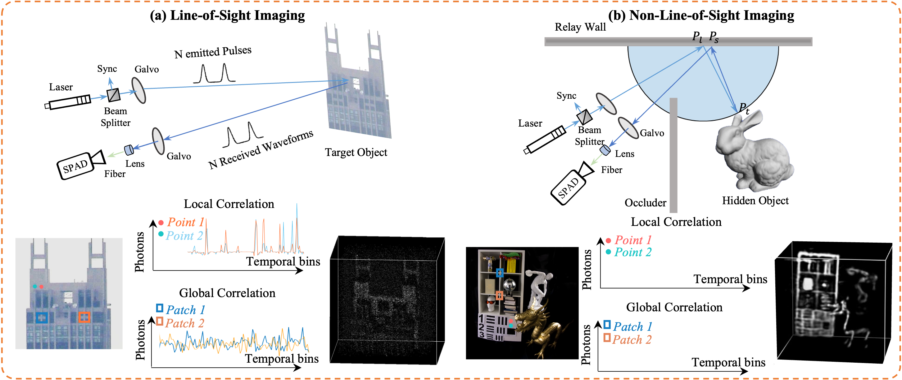
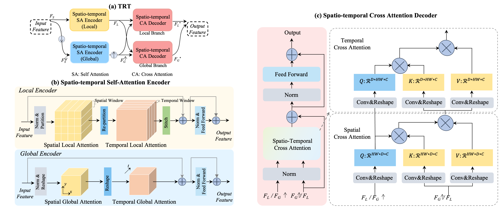

# ✨✨ 3D Reconstruction from Transient Measurements with Time-Resolved Transformer✨✨


## Introduction

<p align="center">
    
</p>

Transient measurements captured by time-resolved imaging systems play a central role in photon-efficient 3D reconstruction, including both **line-of-sight (LOS)** imaging and **non-line-of-sight (NLOS)** imaging. However, transient measurements are typically **high-dimensional**, **sparse**, and **noisy**, which makes accurate 3D reconstruction highly challenging. To address this problem, we propose a generic **Time-Resolved Transformer (TRT)** architecture that explicitly models both **local** and **global spatio-temporal correlations** in transient measurements.  


## Overview

<p align="center">
    
</p>

TRT consists of:
- **Spatio-Temporal Self-Attention (STSA) Encoders** for extracting local and global correlations,
- **Spatio-Temporal Cross-Attention (STCA) Decoders** for integrating complementary features,
- Task-specific embodiments for two representative photon-efficient reconstruction settings:
  - **TRT-LOS** for line-of-sight single-photon imaging,
  - **TRT-NLOS** for non-line-of-sight imaging. 

Extensive experiments on both synthetic and real-world datasets show that TRT achieves superior reconstruction performance and strong generalization across different imaging systems. The paper also introduces a large-scale synthetic LOS dataset and a real-world NLOS dataset captured by a custom-built imaging system. 


##  Repository Structure

```
TRT/
├── TRT-LOS/      # Code for line-of-sight single-photon 3D reconstruction
├── TRT-NLOS/     # Code for non-line-of-sight 3D reconstruction
└── README.md     # Project homepage
```

##  Contact

For questions or collaborations, please contact:\
Yue Li\
University of Science and Technology of China\
📧 yueli65@mail.ustc.edu.cn
