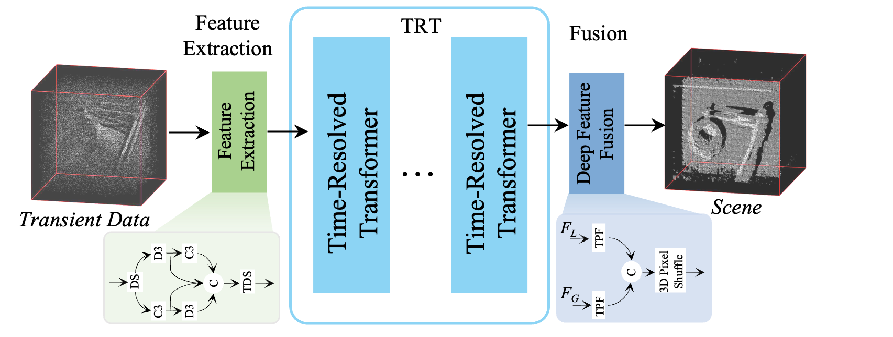

# ✨✨ TRT-LOS 

TRT-LOS is designed for **line-of-sight single-photon 3D reconstruction** from transient measurements acquired by time-resolved sensors such as SPAD + TCSPC systems.

  <a href="https://pan.quark.cn/s/cba827bd9421">🤗 Dataset</a>

    

## Dataset
The synthetic LOS dataset is generated from NYU v2.\
The simulated transient measurements have:\
	•	spatial resolution: 256 × 256\
	•	temporal resolution: 1024 bins\
	•	bin width: 80 ps

Signal/background settings include multiple SBR levels, such as:\
	•	10:2, 5:2, 2:2\
	•	10:10, 5:10, 2:10\
	•	10:50, 5:50, 2:50\
	•	extreme low-SBR settings: 3:100, 2:100, 1:100

Synthetic Test Data:\
The test set is simulated from the Middlebury2014.\
Here is the thumbnail：

    

## Results

    

    

